# Ministry of Education and Science of Ukraine
## National Technical University of Ukraine
### "Igor Sikorsky Kyiv Polytechnic Institute"
#### Faculty of Informatics and Computer Science
#### Department of Information Systems and Technologies

# Modeling of the UART Module

## Coursework Project

### Discipline: "ELECTRONICS AND MICROPROCESSOR TECHNOLOGY"

**Supervisor:** Berdnyk Yu.M.
"Admitted to defense"

**Student:** Shnep R.A.

Group IA-z41, Course 2, Semester 4

Kyiv 2026

---

## ASSIGNMENT
### For the coursework project of student Shnep Roman Antonovych

1. **Project topic:** Modeling of the UART module of the ATmega16 microcontroller

2. **Deadline for submission of the completed project:** _______________

3. **Initial data:**
   - Transmission speed: V_pd = 4800 baud
   - Crystal oscillator clock frequency: f_CLK = 3.6864 MHz
   - UART module to be used for data exchange
   - Transmission mode: asynchronous
   - Data word size: 5 bits
   - Odd parity check to be used
   - Number of stop bits: 2
   - Byte for transmission: 00010010b
   - Character to be received from the virtual terminal: "Q"

4. **Contents of the explanatory note** (list of questions to be addressed): Purpose and application area of the device, technical characteristics, selection and description of the block diagram, calculations confirming the device's operability, development of the algorithm flowchart, control program, and simulation scheme.

5. **List of required graphical material:** electrical structural diagram.

6. **Date of assignment issuance:** 14.02.2026

---

## ABSTRACT

The purpose of this coursework is to consolidate the theoretical principles of the course "ELECTRONICS AND MICROPROCESSOR TECHNOLOGY," to learn to apply the acquired knowledge for practical calculations, and to gain skills in designing individual electronic units of control and automation systems. Completing this coursework serves as preparation for the diploma project.

In this coursework, based on theoretical knowledge gained through the course and laboratory work, a device for information exchange between the UART module and the microcontroller is modeled. The main elements are calculated, and electrical diagrams, an algorithm flowchart, and a simulation scheme of the designed device are developed.

The output is a model of a device for information exchange between the UART module and the microcontroller.

---

## TABLE OF CONTENTS

- Introduction
1. Purpose and area of use
2. Technical characteristics of the device
3. Review of existing solutions, justification of structure selection, and description of device operation according to the block diagram
4. Justification of selection and description of operation of individual device units 
5. Device design 
6. Calculations confirming device operability 
   6.1. Calculation of the UART module 
   6.2. Calculation of exchange speed 
   6.3. Programming the UBRR baud rate control register 
   6.4. Programming the UCSRC register 
   6.5. Programming the UCSRB register 
   6.6. Programming the UDR data register 
7. Development of the algorithm flowchart and control program 
   7.1 Control program in Assembly language 
8. Development and description of the device model operation
- Conclusions 
- List of used sources 
- Appendix A 

---

## INTRODUCTION

The relevance of the project, dedicated to modeling the UART module of microcontrollers manufactured by Microchip Technology based on the AVR architecture, stems from the widespread use of serial interfaces in embedded systems to ensure reliable data exchange between electronic devices. From the end-user perspective, such solutions are applied in consumer electronics, measurement, and industrial systems, where stability and simplicity of implementation are important. In an educational context, modeling the UART contributes to understanding the principles of digital communication and serves as a foundation for further mastery of modern microcontroller platforms.

AVR is an 8-bit microcontroller with RISC architecture and a fast processor core, Flash memory, SRAM, input/output ports, and many interface circuits.

This coursework project involves designing a device for information exchange between the microcontroller's UART module and a virtual terminal, as well as calculating all the necessary data. The ATmega16 microcontroller will be used as the basis of the model.

---

## 1. PURPOSE AND AREA OF USE

The purpose of a Universal Asynchronous Receiver/Transmitter (UART) is to ensure data exchange between digital devices by converting parallel information into serial format for transmission over communication channels, and performing the reverse conversion upon reception. The device operates in asynchronous mode without a separate synchronization signal, which provides flexibility in selecting transmission parameters, and it also implements basic mechanisms for data validity control and interrupt handling.

The application area of UART covers embedded systems of various purposes, including consumer electronics, measuring instruments, automation systems, and telecommunications devices, where reliable and efficient organization of serial data exchange is required.

---

## 2. TECHNICAL CHARACTERISTICS OF THE DEVICE

### 2.1 Technical characteristics of the ATmega16 microcontroller:
- 8-bit microcontroller with AVR architecture, manufactured by Atmel

**2.1.1 Advanced RISC architecture**
- 131 powerful instructions, most executed in a single clock cycle
- 32 × 8-bit general-purpose working registers

**2.1.2 Non-volatile memory segments with high endurance**
- 16 KB Flash program memory with in-system self-programming capability
- 512 bytes EEPROM
- 1 KB internal SRAM
- Data retention: up to 20 years at 85°C / up to 100 years at 25°C

**2.1.3 Differential channels with programmable gain (1×, 10×, 200×)**
- Two-wire serial interface TWI (Two-Wire Interface)
- Programmable serial interface
- SPI (Serial Peripheral Interface) serial interface
- Built-in analog comparator
- Programmable watchdog timer with its own oscillator

**2.1.4 Input/Output**
- 32 programmable input/output lines

**2.1.5 Operating voltage**
- 4.5–5.5 V for ATmega16

**2.1.6 Frequency ranges**
- 0–16 MHz for ATmega16

---

## 3. REVIEW OF EXISTING SOLUTIONS

In modern digital and embedded systems, data transmission between devices is implemented using various interfaces, among which asynchronous serial interfaces of the UART type occupy an important place. There are several main approaches to implementing this functionality: hardware implementation within a microcontroller, software emulation of the interface, and the use of external specialized chips.

Hardware UART implementation, integrated into microcontrollers manufactured by Microchip Technology (AVR architecture), is the most common solution in embedded systems. It provides hardware formation of the data frame, precise timing, support for various operating modes (asynchronous/synchronous), and implementation of error control mechanisms (parity bits, stop bits). The main advantage is minimal CPU load and high transmission stability even at low clock frequencies.

Software implementation of UART (bit-banging) involves forming the serial signal solely through software control of I/O ports. Despite the simplicity of the hardware part, this approach has significant limitations: high sensitivity to interrupts, dependence on clock frequency, and significant CPU load, which reduces overall system efficiency. Therefore, software UART is mainly used in simple or auxiliary tasks.

The use of external UART controllers or interface chips is characteristic of industrial and specialized systems, where increased noise immunity, scalability, or support for physical layer standards (e.g., RS-232, RS-485) is required. Such solutions provide extended functionality and greater reliability in complex operating conditions, but lead to increased cost, power consumption, and complexity of circuit implementation.

Analysis of modern solutions shows that for tasks with low transmission speeds (specifically 4800 baud) and limited hardware resources, using the built-in hardware UART is the most rational choice. This solution provides the necessary accuracy of bit interval formation (especially when using a 3.6864 MHz crystal oscillator, which is a multiple of standard transmission speeds), operational stability, and compliance with international serial exchange standards. Compared to modern high-level microcontrollers (ARM platforms), AVR solutions are inferior in performance but have advantages in simplicity of implementation, low cost, and sufficient functionality for educational and basic engineering tasks. From an economic standpoint, this allows minimizing implementation costs without losing the required technical characteristics. Thus, based on the analysis conducted, it is advisable to choose the principle of building the device using the built-in hardware UART of the AVR microcontroller, which ensures an optimal combination of reliability, cost-effectiveness, ease of implementation, and compliance with the specified technical parameters.

---

## 4. JUSTIFICATION OF SELECTION AND DESCRIPTION OF OPERATION OF INDIVIDUAL DEVICE UNITS

The designed device is implemented on the basis of a microcontroller with an integrated UART module manufactured by Microchip Technology, which is determined by the need to ensure stable and precise asynchronous data exchange under the specified parameters (speed of 4800 baud, non-standard frame format). The choice of hardware UART implementation is justified given the high accuracy of timing interval formation, minimal processor load, and compliance with serial communication standards.

The main unit of the device is the microcontroller, which performs the functions of controlling data transmission and reception, configuring UART operating modes, and processing information. Thanks to the built-in hardware UART, automatic formation of the data frame is ensured, including a start bit, 5 data bits, a parity bit (odd), and two stop bits. The clocking unit is implemented based on an external crystal oscillator with a frequency of 3.6864 MHz. This value is chosen because it is a multiple of standard transmission speeds, particularly 4800 baud, which minimizes speed-setting error and ensures correct synchronization of the transmitter and receiver.

The UART serial interface unit provides bidirectional data exchange via transmit (TX) and receive (RX) lines. Transmission is carried out by sequentially sending the bits of the formed frame, while reception involves reading the input signal with subsequent reconstruction of the parallel data representation. Validity control is implemented using a parity bit, which allows errors during transmission to be detected.

The PROTEUS 8.10 environment is used to model the device's operation, employing a virtual terminal that acts as an external data exchange device. This allows verification of the correctness of transmitting the byte 00010010b and receiving the character "Q" with subsequent analysis of its ASCII code. The software part is implemented in Assembly language, which provides direct control over the microcontroller's hardware resources and precise configuration of UART registers according to the specified parameters. The use of Assembly also allows optimizing program execution and ensuring deterministic timing characteristics.

Thus, the chosen device structure is based on the use of the microcontroller's built-in hardware resources, which allows achieving the necessary accuracy, reliability, and economic efficiency in implementing serial data exchange according to the specified conditions.

---

## 5. DEVICE DESIGN

The working model of the Universal Synchronous/Asynchronous Receiver-Transmitter (USART) interface in the Proteus software is shown in Figure 2.1.

**Figure 2.1 — Working model diagram**
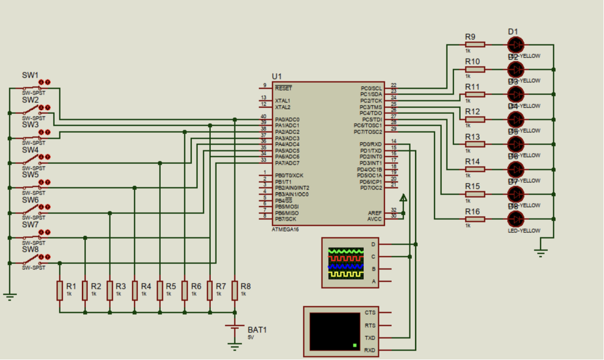

*(Circuit diagram showing ATmega16 microcontroller with 8 switches SW1–SW8 connected to Port A via resistors R1–R8, 8 LEDs D1–D8 connected to Port C via resistors R9–R16, a virtual terminal connected via UART lines, and an oscilloscope monitoring the TXD/RXD lines.)*

This model performs transmission of a signal from the keys located on the left (SW1...SW8), which have a common connection to ground and to power (BAT1, 5V) through resistors (R1...R8). When a key is not pressed, it transmits a logical "1" to the corresponding microcontroller port (PA0...PA7); if, on the other hand, the key is pressed, a logical "0" is transmitted, since the current flowing out and connecting to the pressed key flows to "Ground" (GND).

Logical "0"s and "1"s are transmitted as signals, which is possible because Port A works as an Analog-to-Digital Converter, as indicated by the label ADC (Analog Digital Converter). They are then displayed on the diodes (D1...D8) accordingly.

Also, an oscilloscope is connected to the TxD and RxD lines of the USART module, which reads the analog signal coming from the virtual terminal. Messages that are input/output through the USART module to/from the microcontroller are displayed on it.

Pins XTAL1 and XTAL2, in real circuits, are connected to a crystal oscillator with a frequency that determines the clock frequency of the microcontroller's generator: f_BQ. In our work, it equals 3.6864 MHz. Also connected are capacitors C1 and C2, with a capacitance of 30 pF, intended to increase the stability of the system oscillator's operation. The resonator and capacitors are needed in the practical circuit. In the Proteus model, they may be omitted. To set the frequency, one needs to double-click the left mouse button on the microcontroller and specify the frequency value in the Clock Frequency option, as shown in Figure 2.2.

**Figure 2.2 — Configuring the microcontroller's clock frequency**
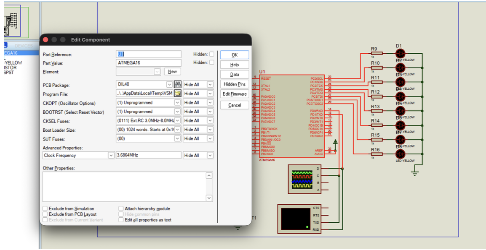
---

## 6. CALCULATIONS CONFIRMING DEVICE OPERABILITY

### 6.1. Calculation of the UART Module

When operating in asynchronous mode, the exchange speed is determined not only by the contents of the UBRR register but also by the state of the U2X (U2Xn) bit of the UCSRA register. If this bit is set to "1," the division factor of the prescaler is reduced by half, and the exchange speed doubles accordingly. When operating in synchronous mode, this bit must be cleared.

Thus, the exchange speed is determined by the following formulas:

- Asynchronous mode (normal, U2Xn = "0"):
  BAUD = f_CLK / [16 × (UBRR + 1)]

- Asynchronous mode (double speed, U2Xn = "1"):
  BAUD = f_CLK / [8 × (UBRR + 1)]

where BAUD is the transmission speed in baud, f_CLK is the microcontroller's clock frequency, and UBRR is the content of the baud rate control register (0...4095).

### 6.2 Calculation of the UBRR Register Value

Table 1 of Appendix A shows the UBRR register values that allow obtaining standard asynchronous mode transmission speeds when using various resonators, as well as the error values obtained relative to standard speeds.

The UBRR register value allows obtaining standard asynchronous mode transmission speeds when using various resonators, as well as the error values relative to standard speeds obtained in this case (standard asynchronous mode transmission speeds for different resonators are marked in yellow).

According to Table 2.1, the task conditions are satisfied by the values UBRR = 47 at U2X = 0, or UBRR = 95 at U2X = 1. In both cases, the error equals 0.0%. We select UBRR = 47 = $2F and U2X = 0.

### 6.3 Programming the UBRR Baud Rate Control Register

For the given microcontroller, the UBRR register, which is 12 bits wide, is physically located in two I/O registers (Table 2 of Appendix A).

These registers have the addresses: UBRR0H = $0040; UBRR0L = $0029.

According to the calculation above, UBRR = 16 = $0010.

Then the program looks like this:

Constant initialization:
```
.equ fCK = 3686400
.equ BAUD = 4800
.equ UBRR_value = (fCK/(BAUD*16))-1

init_USART:
    ldi R16, high(UBRR_value)  ; speed 4800 baud/s
    out UBRRH, R16
    ldi R16, low(UBRR_value)
    out UBRRL, R16
```

### 6.4 Programming the UCSRC Register

The format of the UCSRC register is shown in Figure 2.3, and a description of its individual bits is given in Table 3.

Bit layout: 7:URSEL, 6:UMSEL, 5:UPM1, 4:UPM0, 3:USBS, 2:UCSZ1, 1:UCSZ0, 0:UCPOL

Description of the UCSRC register bits is given in Table 3, Appendix A.

For the ATmega16, according to Table 3, the UMSEL bit programs the operating mode of the USART module. Since the assignment specifies asynchronous mode, this bit must have a value of zero.

Bits UPM1 and UPM0, according to Table 4, control parity checking. In our case, it is necessary to program: UPM1 = 1; UPM0 = 1 (odd parity check).

The parity bit value is obtained by performing an "exclusive OR" operation over all bits of the data word being transmitted. If even parity is used, the resulting value is inverted.

The USBS bit is set to one because we must transmit 2 stop bits.

Bits UCSZ1, UCSZ0, together with bit UCSZ2 of the UCSRB register, program the data word size (Table 5). For our task, it is necessary to program: UCSZ1=0; UCSZ0=0, and UCSZ2=0 (5 bits are transmitted).

The UCPOL bit is not used in asynchronous mode, so we write zero to it.

Bit URSEL = 1, because the write is performed to the UCSRC register.

**Summary:**
- Bit 7 — "1", because access is made to the UCSRC (UCSRnC) register
- Bit 6 — "0", because the USART module operates in asynchronous mode
- Bit 5 — "1", because odd parity check is needed
- Bit 4 — "1", because odd parity check is needed
- Bit 3 — "1", because 2 stop bits are needed
- Bit 2 — "0", because the word size equals 5 bits
- Bit 1 — "0", because the word size equals 5 bits
- Bit 0 — "0", clock polarity is not used

Assembly encoding of the register:
```asm
ldi R16, (1<<URSEL)|(0<<UCSZ1)|(1<<UPM1)|(1<<UPM0)|(0<<UCSZ0)|(1<<USBS)
out UCSRC, R16
```

### 6.5 Programming the UCSRB Register

The format of the UCSRB register is shown in Figure 2.4, and a description of its bits is given in Table 6.

Bit layout: 7:RXCIE, 6:TXCIE, 5:UDRIE, 4:RXEN, 3:TXEN, 2:UCSZ2, 1:RXB8, 0:TXB8

For our example, it is necessary to program: TXCIE = 0; UDRIE = 0; UCSZ2 = 0 (Table 5); RXEN = 1 and TXEN = 1. The other bits are not used, so we write zeros to them.

**Summary:**
- Bit 7 — "0", interrupt disabled after completion of reception
- Bit 6 — "0", interrupt disabled after completion of transmission
- Bit 5 — "0", interrupt disabled when clearing the UART data register
- Bit 4 — "1", enables receiver operation
- Bit 3 — "1", enables transmitter operation
- Bit 2 — "0", because the word size equals 5 bits
- Bit 1 — "0", 9th bit of received data not used
- Bit 0 — "0", 9th bit of transmitted data not used

Assembly encoding of the register:
```asm
ldi R16, (1<<RXEN)|(1<<TXEN)
out UCSRB, R16
```

### 6.6 Programming the UDR Register

According to Table 7, the UDR data register of our microcontroller has address $000C. After loading a data byte from register R16 into the UDR (USART Data Register), the ATmega16's USART module automatically forms a transmission frame in start-stop format and sends it via the TXD line (PD1).

The `USART_send` subroutine writes the data byte to the UDR register with the command:
```asm
out UDR, R16
```

After this, the TXC (Transmit Complete) flag of the UCSRA register is polled. The flag is set by hardware after the transmission of the entire frame, including the start bit, data bits, and stop bits, is complete.

```asm
sending:
    in R17, UCSRA
    sbrs R17, TXC
    rjmp sending
```

After transmission is complete, the TXC flag is cleared by writing a logical one to the corresponding bit of the UCSRA register:

```asm
ldi R17, (1<<TXC)
out UCSRA, R17
```

The `USART_receive` subroutine implements data reception via USART. First, the RXC (Receive Complete) flag is polled, which is set after a full frame is received.

```asm
receive_wait:
    in R17, UCSRA
    sbrs R17, RXC
    rjmp receive_wait
```

After the RXC flag is set, the received byte is read from the UDR register into register R16:

```asm
in R16, UDR
```

Thus, the `USART_send` subroutine provides transmission of a single data byte via the serial USART interface, and the `USART_receive` subroutine provides reception of a single byte with subsequent storage in register R16.

---

## 7. DEVELOPMENT OF THE ALGORITHM FLOWCHART AND CONTROL PROGRAM

### 7.1 CONTROL PROGRAM IN ASSEMBLY LANGUAGE

```asm
.nolist                    ; disable output of the system file to listing
.include "m16def.inc"      ; include the definitions file for ATmega16
.list                      ; re-enable listing

.equ fCK = 3686400         ; MCU clock frequency = 3.6864 MHz
.equ BAUD = 4800           ; USART speed = 4800 baud
.equ UBRR_value = (fCK/(BAUD*16))-1  ; calculation of the UBRR register value

.cseg                      ; start of program memory segment
.org 0                     ; program start address
    rjmp main               ; jump to main after reset

main:
    rcall init_USART        ; (block 1) call the USART initialization subroutine
    ldi R16, 0xFF           ; load 11111111b
    out DDRC, R16           ; make all Port C lines outputs
    ldi R16, 0x00           ; load 00000000b
    out DDRA, R16           ; make all Port A lines inputs

loop:
    rcall USART_receive     ; receive a byte via USART into R16
    out PORTC, R16          ; output received byte to Port C LEDs
    in R16, PINA             ; read current state of Port A buttons
    out PORTC, R16          ; display button state on LEDs
    rcall USART_send         ; transmit the read byte via USART
    rjmp loop                ; infinite loop

init_USART:
    ldi R16, high(UBRR_value)  ; high byte of baud rate divisor
    out UBRRH, R16              ; write to UBRRH
    ldi R16, low(UBRR_value)    ; low byte of baud rate divisor
    out UBRRL, R16               ; write to UBRRL
    ldi R16, (1<<RXEN)|(1<<TXEN) ; enable receiver and transmitter
    out UCSRB, R16                ; write to UCSRB register
    ldi R16, (1<<URSEL)|(0<<UCSZ1)|(1<<UPM1)|(1<<UPM0)|(0<<UCSZ0)|(1<<USBS)
    ; frame parameter configuration:
    ; URSEL=1 - write to UCSRC
    ; UPM1=1, UPM0=1 - Odd parity
    ; USBS=1 - 2 stop bits
    ; UCSZ1=0, UCSZ0=0 - 5 data bits
    out UCSRC, R16               ; write USART configuration
    ret                           ; return from subroutine

USART_send:
    out UDR, R16             ; write byte to USART transmit buffer
sending:
    in R17, UCSRA            ; read USART status
    sbrs R17, TXC             ; check transmit complete flag
    rjmp sending               ; if transmission not complete - wait
    ldi R17, (1<<TXC)         ; prepare TXC bit for clearing
    out UCSRA, R17            ; clear TXC flag
    ret                        ; return

USART_receive:
receive_wait:
    in R17, UCSRA             ; read USART status
    sbrs R17, RXC              ; check receive flag
    rjmp receive_wait            ; if no data - wait
    in R16, UDR                ; read received byte into R16
    ret                          ; return

end:
    rjmp end                    ; infinite loop (actually not used)
```

To compile the working program and obtain a hex file, an Integrated Development Environment can be used — in this case, Atmel Studio 7 — for programming AVR microcontrollers in C/C++ and Assembly. Specifically in this case, the program code for the controller is described directly in the VSM Studio environment of the Proteus software.

---

## 8. MODELING THE DEVICE IN THE PROTEUS PACKAGE

The first step is to configure the terminal to transmit a character (char) with the transmission speed (baud rate) specified in the assignment — 4800. Unfortunately, the terminal settings do not allow changing the data size in the sent frames, so we keep it at 8 (data bits), set the parity to odd mode (ODD) as required by the assignment, and the stop bits field value will be 2, as per the assignment conditions. The overall picture is shown in Figure 3.1.

**Figure 3.1 — Virtual terminal configuration**
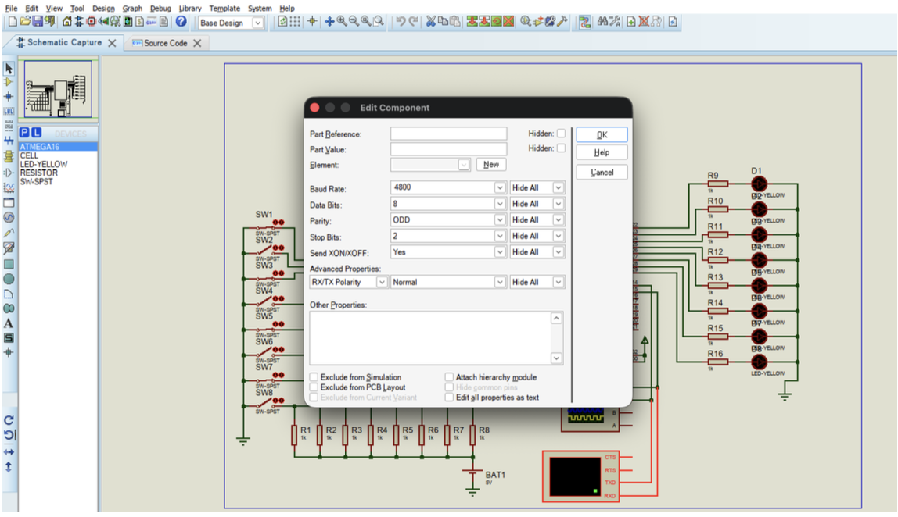
Next, it is necessary to configure the LEDs to receive a digital signal, i.e., logical "0"s and "1"s. To do this, one needs to enter the configuration settings the same way as was done for the terminal (double left-click on the required component). Configuration details are shown in Figure 3.2.

**Figure 3.2 — Configuring the LEDs for digital mode**

Once all preliminary settings are complete, the simulation process must be started by clicking "Start VSM Debugging" (Figure 3.3).

**Figure 3.3 — Starting the simulation process**

Also, after starting, we set two breakpoints during program execution, then click "Pause VSM Debugging." In the "Source Code" tab, two breakpoints are set. To do this, double-click the left mouse button on the left side of two commands, as shown in Figures 3.4–3.5. This is done to visually capture the result of entering a character from the terminal on the LEDs.

**Figure 3.4 — Setting two breakpoints, point 1**
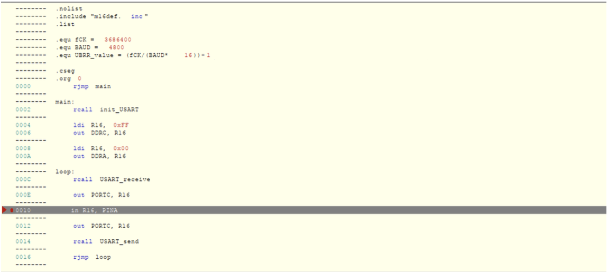
**Figure 3.5 — Setting two breakpoints, point 2**
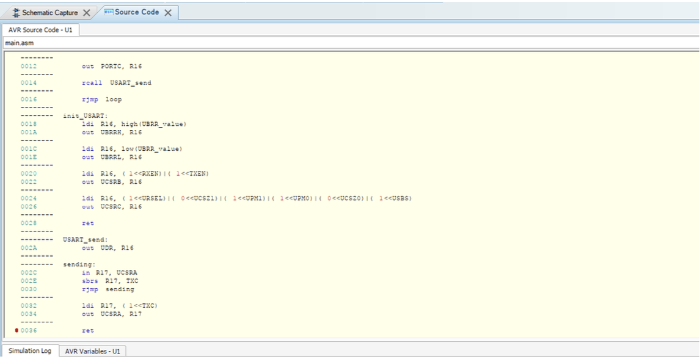
### Entering the character sent from the virtual terminal

When entering a character from the virtual terminal, the following must be done:

1) In the "Virtual Terminal" window, right-click and select: "Hex Display Mode" and "Echo Typed Characters" (Figure 3.6). If the Virtual Terminal window is closed, it can be opened from the Debug tab.

**Figure 3.6 — Setting virtual terminal options**
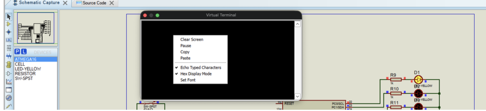
This allows capturing the HEX value that is sent and received to/from the terminal.

2) It is also necessary to configure the oscilloscope to read the alternating current (AC) from the cable connected to the transmit channel from the terminal (TXD) to the controller — red color on the oscilloscope — and the cable connected to the receive channel (RXD) to the terminal — green color. The result is demonstrated in Figure 3.7.

**Figure 3.7 — Oscilloscope configuration**
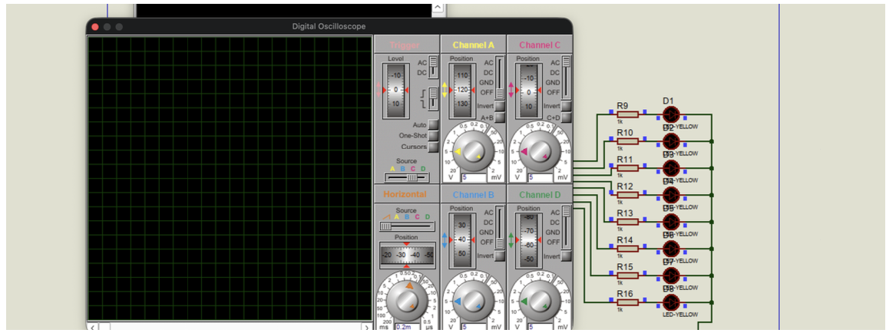
3) Press "Run Simulation" (F12).

4) Before entering a character, the cursor must be positioned in the terminal window.

5) Enter the character sent from the virtual terminal to the microcontroller via UART. The character entered from the keyboard is converted by the virtual terminal into an ASCII code according to Figure 3.8. In this case, per the assignment, the character "Q" is specified.

**Figure 3.8 — Character "Q" in the ASCII table**
(Character: Q, Code: Shift+Q, Decimal: 81, Binary: 01010001, Hex: 51)
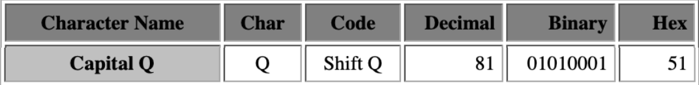
The program will proceed to the line where the first breakpoint is set. In the "Schematic Capture" tab, the character received from the terminal is displayed on the LEDs and oscilloscope via Port C outputs (Figure 3.9).

**Figure 3.9 — Display on LEDs and oscilloscope of the character "Q" received from the terminal**
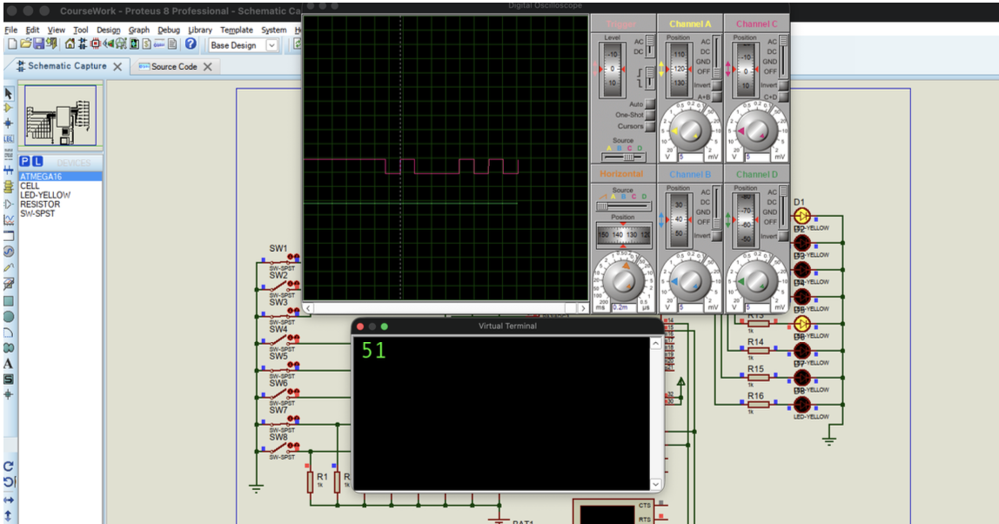
Since 5 bits are allocated for data content, the character "Q" is displayed as: 000|10001b, where "|" marks the point where data transmission from the terminal ends, although the actual binary value of the character "Q" is 01010001b, as confirmed by the oscilloscope readings, where the lower level is a logical "0" and the upper level is a logical "1". After discarding the first drop (i.e., the start bit), we obtain the inverted binary value of the character "Q". Since the number of ones is not even, the parity bit will equal 1, followed by 2 stop bits. A visual example of the packet is shown in Figure 3.10.

**Figure 3.10 — Frame format displayed by the oscilloscope as signals**
(Start Bit (1 bit), Data Frame (5 to 9 Data Bits), Parity Bits (0 to 1 bit), Stop Bits (1 to 2 bits))
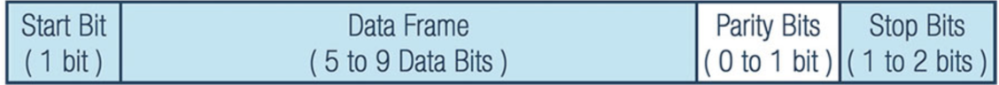
### Entering the character sent from the microcontroller via UART

1) The number to be transmitted from the microcontroller via UART is encoded by buttons: a closed button = zero, an open button = one (Figure 3.11).

**Figure 3.11 — Encoding the transmitted character with keys**
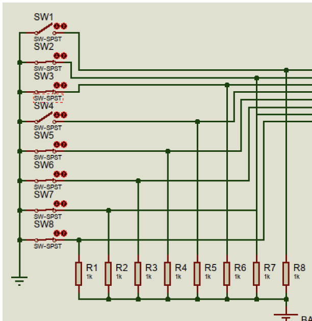
2) To see the transmitted signal on the oscilloscope, click the One-Shot option button (Figure 3.7).

3) To continue program execution, click "Run Simulation" again. The program proceeds to the second breakpoint.

4) The signals displayed on the oscilloscope are explained below: the oscilloscope displays signals on two traces — the upper (green) is the signal transmitted from the buttons, the lower (red) is the signal received from the terminal: 51 (hex) (Figure 3.12).

**Figure 3.12 — Signals on the oscilloscope: from terminal — red; from MCU (buttons) — green**
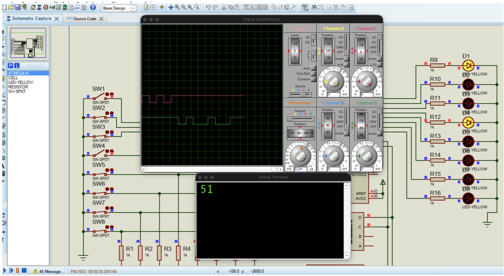
The first signal transition transmitted from the keys, from high to low level, is the start bit. Then follow eight data bits, starting from the least significant bit, which are displayed on the oscilloscope as 10010000 (bin) = 90 (hex). Figure 3.13.

(Diagram showing: Start bit (0), Data bits (MSB→LSB) 10010000, Parity bit (0 - even parity), Stop bits (2 bits))

UART module configuration (UCSRC register):
| URSEL | UCSZ1 | UPM1 | UPM0 | UCSZ0 | USBS | UCPOL |
|-------|-------|------|------|-------|------|-------|
| 1 | 0 | 1 | 1 | 0 | 1 | 0 |

- URSEL = 1 → access to UCSRC
- UCSZ1:UCSZ0 = 0:0 → 5 data bits
- UPM1:UPM0 = 1:1 → odd parity
- USBS = 1 → 2 stop bits
- UCPOL = 0 → normal polarity

Instructions used:
```asm
ldi R16, (1<<URSEL)|(0<<UCSZ1)|(1<<UPM1)|(1<<UPM0)|(0<<UCSZ0)|(1<<USBS)
out UCSRC, R16
ret
USART_send:
out UDR, R16    ; transmit byte from R16 via UART
```

However, there is a nuance: since the assignment conditions are not the standard 8 bits, the terminal's RXD/TXD port configuration does not match the reception of a 5-bit data packet. As a result, on the terminal we do not get a display of the hex value transmitted by the buttons, since we get a parity error, which precisely indicates a frame error.

```
PC=0x002B. [AVR USART] UDR write: 0xFE.
PC=0x002C. [AVR USART] Transmitting data: 1 start, 5 data (0x1E), 1 parity (0), 2 stop.
[VTERM] Parity Error
```

### Determining the achieved transmission speed

To determine the achieved transmission speed, which in this example was set at 4800 bits/sec = 4800 symbols/sec = 4800 baud, the oscilloscope signal sweep is configured to align the sides of the pulse with the vertical grid lines of the oscilloscope.
---

## Development of the Structural Diagram of the Device

Figure 4.1 below shows the structural diagram of the device for information exchange between the UART module of the ATmega16 microcontroller and the virtual terminal. The main unit of the diagram is the microcontroller, which performs reception, processing, and transmission of data.

Through the parallel port PA0–PA7 (Port A), the microcontroller receives signals from eight buttons SW1–SW8. Each button corresponds to one data bit, so their state forms an 8-bit byte. Signals from the buttons are fed to the microcontroller inputs through resistors R1–R8, which ensure correct input operating mode.

The formed byte is read by the microcontroller and transmitted via the UART module in serial asynchronous start-stop mode from output PD1 (TXD) to the RXD input of the virtual terminal. Transmission is carried out at a speed of 4800 baud, at a microcontroller clock frequency of 3.6864 MHz.

From the virtual terminal, via the TXD → PD0 (RXD) line, the microcontroller receives serial data. After reception is complete, the byte is written to port PC0–PC7 (Port C) and displayed using LEDs D1–D8. Each LED corresponds to one bit of the received byte, allowing visual monitoring of the reception result. Resistors R9–R16 limit the current through the LEDs and protect the microcontroller outputs.

To form the clock frequency, a crystal oscillator with a frequency of 3.6864 MHz is used, connected to pins XTAL1 and XTAL2. Capacitors C3 and C4 ensure stable operation of the oscillator and the required startup mode of the crystal resonator.

The reset circuit consists of resistor Rst and button SW. It forms the RESET signal, which puts the microcontroller into its initial state and starts program execution from the beginning. Reset can be performed either after power-up or by pressing the manual reset button.

Thus, the circuit implements bidirectional data exchange between the microcontroller and the virtual terminal: transmission of button states to the terminal via UART, and reception of data from the terminal with subsequent display of the received byte on the LED indicator.

**Figure 4.1 — Structural diagram of the device for information exchange between the UART module of the ATmega16 microcontroller and the virtual terminal**
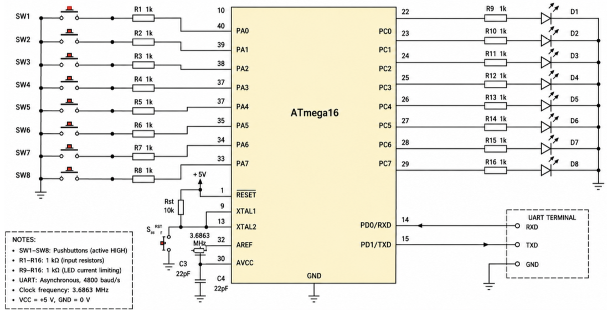
*(Diagram showing: SW1–SW8 pushbuttons (active HIGH) connected via R1–R8 (1kΩ input resistors) to Port A (PA0–PA7); ATmega16 microcontroller; Port C (PC0–PC7) connected via R9–R16 (1kΩ LED current limiting) to LEDs D1–D8; RESET circuit with Rst (10kΩ) and button; 3.6864 MHz crystal with C3, C4 (22pF) at XTAL1/XTAL2; UART Terminal connected to PD0/RXD and PD1/TXD; UART: Asynchronous, 4800 baud/s; VCC = +5V, GND = 0V)*

---

## CONCLUSIONS

In the course of this work, all stages of designing and developing a device for information exchange between the UART module of the ATmega16 microcontroller and a virtual terminal were carried out. The development, presentation, and description of the working model in the Proteus 8.6 package were performed, along with the calculation of the UART module, including calculations and programming of the UCSRC, UCSRB registers, the UBRR baud rate control register, and the UDR data register.

An algorithm flowchart for the device's operation and its control program in Assembly language were developed. Simulation of the device in the Proteus 8.6 package was carried out with a detailed subsequent analysis through screenshots illustrating the model's operation and confirming the correctness of the calculations performed and the algorithm and program schemes. In the theoretical part of the work, the purpose and area of use of the UART module of microcontrollers were described, including trends in their development. The technical characteristics of the ATmega16 microcontroller device were analyzed in detail, and its main advantages were identified, along with a brief justification of the choice of device structure and functionality. The next stage was the development and description of the working model in the Proteus package and the calculation of the UART module for the ATmega16 microcontroller. Creating the algorithm flowchart for the device's operation based on this microcontroller made it possible to implement a working program in Assembly language. Next, the construction and testing of the device model in the Proteus 8.6 package was carried out. The virtual terminal was configured to the operating mode specified in the assignment, and step-by-step program execution with stops at defined points was performed through the debugger.

The result was the transmission of a character from the virtual terminal to the microcontroller, its conversion into the corresponding ASCII code, and the display of signals on the oscilloscope and LEDs. The final stage was the development and description of the device's structural diagram.

As a result of this coursework, a model of a device for information exchange between the UART of the ATmega16 microcontroller and a virtual terminal was created.

---

## LIST OF USED SOURCES

1. ATmega16 manual [Electronic resource] — https://ccrma.stanford.edu/workshops/mid2005/docs/ATMega16_Summary.pdf
2. UART: A Hardware Communication Protocol — Understanding Universal Asynchronous Receiver/Transmitter [Electronic resource] — https://www.analog.com/en/resources/analog-dialogue/articles/uart-a-hardware-communication-protocol.html
3. GPIO Ports and Registers in AVR ATmega16/ATmega32 [Electronic resource] — https://www.electronicwings.com/avr-atmega/atmega1632-gpio-ports-and-registers
4. AVR Instruction Set Manual [Electronic resource] — https://ww1.microchip.com/downloads/en/DeviceDoc/AVR-Instruction-Set-Manual-DS40002198A.pdf

---

## Appendix A

### Table 1 — Example UBRR register values for various oscillator frequencies

*(Table listing UBRR values and error percentages for standard baud rates — 2400, 4800, 9600, 14400, 19200, 28800, 38400, 57600, 76800, 115200, 230400, 250000, 0.5M, 1.0M baud — across oscillator frequencies of 1.0000 MHz, 1.8432 MHz, 2.0000 MHz, 3.6864 MHz, 4.0000 MHz, and 7.3728 MHz, for both U2X=0 and U2X=1 modes. Values shown in the original table for 3.6864 MHz at 4800 baud: UBRR=47, error 0.0%.)*

Note: At UBRR = 0, error = 0.0%

### Table 2 — Baud rate control register locations by model

*(Table listing UBRRH/UBRRL register addresses for various AVR models: ATmega8515x/8535x, ATmega8x/16x/32x, ATmega64x/128x, ATmega48x/88x/168x, ATmega162x, ATmega164x/324x/644x, ATmega165x/325x/3250x/645x/6450x, ATmega640x/1280x/2560x, ATmega1281x/2561x, with dual UART register sets for multi-UART models.)*

Note: In these models, the UBRRH (UBRRnH) register is located at the same address as the UCSRC (UCSRnC) register.

### Table 3 — Description of UCSRC (UCSRnC) register bits

| Bit | Name | Description |
|-----|------|-------------|
| 7 | UMSELn1 / URSEL (URSELn) | **UMSELn1** — USART operating mode (models 48x/88x/168x, 164x/324x/644x, and 640x/1280x/1281x/2560x/2561x): together with UMSELn0 determines USART operating mode. **URSEL** — Register select: determines which register is being written. If set to "1," access is to the UCSRC (UCSRnC) register; if cleared to "0," access is to the UBRRH (UBRRnH) register. |
| 6 | UMSEL (UMSELn) / UMSELn0 | **UMSEL** — USART operating mode: if cleared to "0," the USART operates in asynchronous mode; if set to "1," synchronous mode. **UMSELn0** — together with UMSELn1, determines USART operating mode (same model list as above). |
| 5 | UPM1 (UPMn1) | Parity control and generation circuit mode. Bits 5 and 4 determine the operation of the parity check and generation circuits (Table 4). |
| 4 | UPM0 (UPMn0) | (see above) |
| 3 | USBS (USBSn) | Number of stop bits: determines the number of stop bits sent by the transmitter. If cleared to "0," the transmitter sends 1 stop bit; if set to "1," 2 stop bits. For the receiver, the content of this bit is irrelevant. |
| 2 | UCSZ1 (UCSZn1) | Frame format: together with bit UCSZ2 (UCSZn2), these bits determine the number of data bits and the word size (Table 5). |
| 1 | UCSZ0 (UCSZn0) | (see above) |
| 0 | UCPOL (UCPOLn) | Clock polarity: determines the moment of data output and reading on the module's pins. Used only in synchronous mode. In asynchronous mode, it must be cleared to "0." |

**Note:** * — reserved in ATmega64x/128x models

### Table — UCPOL clock polarity behavior

| UCPOL (UCPOLn) | Data output on TXD (TXDn) | Data read on RXD (RXDn) |
|----------------|---------------------------|--------------------------|
| 0 | Rising edge of XCK (XCKn) | Falling edge of XCK (XCKn) |
| 1 | Falling edge of XCK (XCKn) | Rising edge of XCK (XCKn) |

### Table 4 — Parity control (UPM1, UPM0)

| UPM1 (UPMn1) | UPM0 (UPMn0) | Mode |
|--------------|--------------|------|
| 0 | 0 | Disabled |
| 0 | 1 | Reserved |
| 1 | 0 | Enabled, even parity check |
| 1 | 1 | Enabled, odd parity check |

### Table 5 — Data word size programming (UCSRB register)

| UCSZ2 (UCSZn2) | UCSZ1 (UCSZn1) | UCSZ0 (UCSZn0) | Data Word Size |
|----------------|------------------|------------------|-----------------|
| 0 | 0 | 0 | 5 bits |
| 0 | 0 | 1 | 6 bits |
| 0 | 1 | 0 | 7 bits |
| 0 | 1 | 1 | 8 bits |
| 1 | 0 | 0 | Reserved |
| 1 | 0 | 1 | Reserved |
| 1 | 1 | 0 | Reserved |
| 1 | 1 | 1 | 9 bits |

### Table 6 — Description of UCSRB (UCSRnB) register bits

| Bit | Name | Description |
|-----|------|-------------|
| 7 | RXCIE (RXCIEn) | Receive complete interrupt enable: if set to "1," an interrupt is generated when the RXC (RXCn) flag of the UCSRA (UCSRnA) register is set, provided the I flag of the SREG register is set to "1." |
| 6 | TXCIE (TXCIEn) | Transmit complete interrupt enable: if set to "1," an interrupt is generated when the TXC (TXCn) flag of the UCSRA (UCSRnA) register is set, provided the I flag of SREG is set to "1." |
| 5 | UDRIE (UDRIEn) | Data register empty interrupt enable: if set to "1," an interrupt is generated when the UDRE flag in UCSRA (UCSRnA) is set, provided the I flag of SREG is set to "1." |
| 4 | RXEN (RXENn) | Receiver enable: if set to "1," receiver operation is enabled and the function of the RXD (RXDn) pin is redefined. When RXEN (RXENn) is cleared, receiver operation is disabled and its buffer is cleared. The RXC (RXCn), DOR/OR, and FE (FEN) flag values become invalid. |
| 3 | TXEN (TXENn) | Transmitter enable: setting this bit to "1" enables UART/USART transmitter operation and redefines the function of the TXD (TXDn) pin. If cleared to "0" during transmission, the transmitter is disabled only after data transmission in the shift register and transmit buffer is complete. |
| 2 | UCSZ2 (UCSZn2) | Packet format: used to set the size of data words transmitted over the serial channel. In USART modules, it is used together with bits UCSZ1:0 (UCSZn1:0) of the UCSRC (UCSRnC) register. In UART modules, if the CHR9 (CHR9n) bit is set to "1," 9-bit data is transmitted/received; if cleared, 8-bit data. |
| 1 | RXB8 (RXB8n) | 9th bit of received data: when using 9-bit data words, this bit holds the value of the most significant bit of the received word. For USART, the content of this bit must be read before reading the UDR data register. |
| 0 | TXB8 (TXB8n) | 9th bit of transmitted data: when using 9-bit data words, the content of this bit is the most significant bit of the word being transmitted. The required value must be written to this bit before loading the data byte into the UDR register. |

### Table 7 — Location of USART/UART data registers

*(Table listing UDR/UDR0/UDR1/UDR2/UDR3 register addresses across various AVR models: ATmega8515x/8535x, ATmega8x/16x/32x, ATmega64x/128x, ATmega48x/88x/168x, ATmega162x, ATmega164x/324x/644x, ATmega165x/325x/3250x/645x/6450x, ATmega640x/1280x/1281x, ATmega2560x/2561x — with the description column noting which register serves which USART instance (USART0, USART1, USART2, USART3) per model.)*
